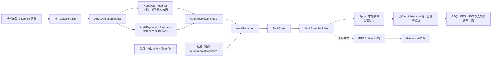

# Smile Audit Starter 接入与落地流程

## 1. 文档目的

本文规定 `smile-audit-starter` 在各微服务中的统一接入方式，确保业务服务只声明“谁在什么时候对什么目标执行了什么操作”，不重复实现审计切面、SpEL 解析和事件发布逻辑。

本文适用于：

- 新增微服务接入操作审计；
- 已登录业务的手工审计迁移为 `@AuditOperation`；
- 登录、自助恢复和系统任务接入编程式 `AuditRecorder`；
- 本地 Spring 事件异步落库；
- 后续平滑迁移到 Outbox 和消息队列。

本文不允许微服务跨库写入 Auth、IAM 或其它服务的审计表。每个服务必须独立拥有自己的审计数据，或通过未来明确发布的审计事件契约交由独立消费者处理。

所有由 HTTP 请求触发的审计事件都会在原业务线程自动读取 Gateway 清洗后的 `X-Smile-Client-IP`，并把完整客户端 IP 与 SHA-256 摘要一起固化到异步事件。业务注解不需要声明 IP 参数，异步监听器也不得在线程切换后重新读取请求上下文。由用户操作产生的 Outbox 必须在事件载荷中继续传递原始 `ipAddress`，消费服务禁止使用内部投递请求的服务地址覆盖它。只有 XXL-JOB 等不存在用户 HTTP 来源的纯系统任务允许 IP 为空，并应使用明确的系统操作人。

## 2. 总体流程



## 3. 职责边界

### 3.1 Starter 统一负责

`smile-audit-starter` 负责：

- 提供 `@AuditOperation` 注解；
- 提供编程式 `AuditRecorder` 和 `AuditRecordCommand`；
- 拦截公共 Spring Service 方法；
- 在原业务线程中获取操作人不可变快照；
- 解析方法参数、`result`、`error` 和 `actor` 的 SpEL 表达式；
- 记录动作编码、中文动作名称、目标快照、结果、失败码、链路 ID、发生时间和执行耗时；
- 成功事件在本地业务事务提交后发布；
- 没有事务的成功事件在方法成功返回后发布；
- 按注解配置记录业务失败或拒绝事件；
- 默认使用 Spring `ApplicationEventPublisher` 发布本地事件；
- 审计构造或发布异常只记录日志，不改变原业务结果。

### 3.2 接入微服务负责

每个接入服务必须负责：

- 引入 `smile-audit-starter`；
- 实现本服务的 `AuditActorResolver`；
- 为本服务设计并维护审计表、Entity、Mapper 和 Writer；
- 使用项目统一有界线程池异步监听 `AuditEvent`；
- 按 `eventId` 设计幂等写入能力；
- 过滤只属于本服务的 `source`；
- 对敏感字段进行脱敏，禁止保存密码、Token、密钥或完整手机号；
- 编写相关单元测试和数据库验证脚本。

## 4. 标准接入步骤

### 4.1 引入 Maven 依赖

在需要审计的可部署服务 `pom.xml` 中加入：

```xml
<dependency>
    <groupId>com.canteen</groupId>
    <artifactId>smile-audit-starter</artifactId>
</dependency>
```

Starter 已通过 Spring Boot AutoConfiguration 自动装配，无需在业务服务中手工创建审计切面。

### 4.2 准备本服务审计表

审计表由当前微服务独立拥有，DDL 必须放在根目录：

```text
sql/<service>/ddl/
```

DDL 必须遵守以下要求：

- 使用 PostgreSQL sequence + bigint 主键策略；
- 表和每一个字段均使用 `COMMENT ON TABLE`、`COMMENT ON COLUMN` 添加中文说明；
- 保存全局唯一 `event_id` 并建立唯一约束，用于重复投递时幂等消费；
- 保存事件发生时的操作人、目标、动作名称和分类路径快照，查询时不得依赖当前用户名称或当前业务对象反查历史含义；
- 为租户、机构、发生时间及常用查询条件建立必要索引；
- 不保存密码、Token、密钥、完整手机号或未脱敏设备敏感信息；
- SQL 在 `sql/CHANGELOG.md` 登记并由开发者人工执行，当前不引入 Flyway。

已经在共享环境执行的 SQL 禁止修改，后续调整必须增加更高编号脚本。

### 4.3 实现操作人解析器

普通登录后业务必须从本服务当前可信 Sa-Token 会话解析操作人：

```java
@Component
public class XxxAuditActorResolver implements AuditActorResolver {

    /** @return 当前业务线程中的登录人不可变快照 */
    @Override
    public AuditActor resolve() {
        if (!StpUtil.isLogin()) {
            return AuditActor.system();
        }
        // 根据本服务真实的 LoginId 和 Token Session 属性构造 AuditActor。
        // 禁止从 Controller DTO、请求头中的自报字段或前端隐藏字段构造操作人。
        return new AuditActor(
                tenantId,
                operatorType,
                operatorId,
                organizationId,
                username,
                displayName,
                appCode
        );
    }
}
```

约束：

- 操作人必须在原业务线程中读取并形成快照；
- 异步线程不得重新读取 Sa-Token 上下文；
- 无登录人的系统任务必须明确使用 `SYSTEM`，不得冒用普通用户；
- 不允许同时提供多个 `AuditActorResolver` 而不明确装配优先级。

如果服务没有实现 `AuditActorResolver`，Starter 会使用明确的系统主体作为默认值，但面向登录用户的业务服务不得依赖该默认行为交付审计功能。

### 4.4 实现异步事件监听器

```java
@Component
@RequiredArgsConstructor
public class XxxAuditEventListener {

    /** 当前服务的审计落库服务。 */
    private final XxxAsyncAuditWriter writer;

    /**
     * 只消费属于当前服务的数据，使用项目统一业务线程池异步执行。
     *
     * @param event 通用审计事件
     */
    @Async("applicationTaskExecutor")
    @EventListener
    public void onAuditEvent(AuditEvent event) {
        if (!"XXX".equals(event.source())) {
            return;
        }
        try {
            writer.write(event);
        } catch (RuntimeException exception) {
            log.error(
                    "Async audit persistence failed, eventId={}, actionCode={}",
                    event.eventId(),
                    event.actionCode(),
                    exception
            );
        }
    }
}
```

禁止使用：

- `new Thread()`；
- `Executors.newFixedThreadPool()`；
- 默认 `CompletableFuture.runAsync()`；
- 在监听器中跨服务直接访问其它服务数据库。

### 4.5 实现独立事务 Writer

```java
@Service
@RequiredArgsConstructor
public class XxxAsyncAuditWriter {

    /** 当前服务审计 Mapper。 */
    private final XxxAuditMapper mapper;

    /**
     * 使用独立事务保存审计事件。
     *
     * @param event 已包含操作人和目标快照的审计事件
     */
    @Transactional(propagation = Propagation.REQUIRES_NEW)
    public void write(AuditEvent event) {
        XxxAuditEntity entity = toEntity(event);
        mapper.insert(entity);
    }
}
```

Writer 必须：

- 显式完成 `AuditEvent -> Entity` 转换；
- 对超长文本进行确定性长度限制；
- 以 `eventId` 保证重复消费幂等；
- 使用显式字段列表，禁止 `SELECT *`；
- 落库失败记录事件 ID 和动作编码，但不得打印敏感正文。

### 4.6 在公共 Service 方法声明审计

```java
@AuditOperation(
        source = "XXX",
        categoryPath = {"租户端", "业务管理", "示例业务"},
        actionCode = "xxx:business:create",
        actionName = "新增示例业务",
        targetType = "BUSINESS_RECORD",
        targetId = "#result.id",
        targetName = "#request.name",
        targetCode = "#result.businessCode",
        reason = "#request.reason"
)
@Transactional
public BusinessVO createBusiness(CreateBusinessDTO request) {
    // 真实业务实现
}
```

注解约束：

- 只能用于由 Spring AOP 代理调用的公共 Service 方法；
- 禁止放在私有方法上并认为能够生效；
- 同一个类内部的自调用不会经过 Spring AOP，不能依赖自调用触发审计；
- `actionCode` 发布后永久保留，不得修改含义或复用；
- `actionName` 使用面向审计人员的中文名称，并作为事件发生时快照保存；
- `categoryPath` 是任意层级的中文分类快照，不与菜单、路由和权限资源强关联；
- `targetType` 使用稳定的业务目标类型；
- `targetId` 必须能唯一定位被操作目标；
- 敏感操作的 `reason` 应记录管理员实际填写的原因；
- 完整手机号禁止进入注解表达式，只允许传入已经脱敏的手机号。

## 5. SpEL 表达式规则

审计表达式只解析注解显式声明的字段，不会自动序列化全部方法参数。

### 5.1 可用变量

假设方法签名为：

```java
public BusinessVO updateBusiness(UpdateBusinessDTO request, long businessId)
```

可使用：

```text
#request.name
#businessId
#result.id
#error
#actor.operatorId
```

含义：

- `#request`、`#businessId`：按被拦截方法的真实参数名读取；
- `#result`：方法成功返回值；
- `#error`：方法抛出的异常；
- `#actor`：方法执行前捕获的操作人快照。

例如：

```java
targetName = "#request.displayName ?: #request.username"
```

表示显示名称为空时使用用户名。方法参数或 DTO 字段重命名时，必须同步修改注解表达式并执行相关测试。

### 5.2 禁止事项

- 禁止引用密码、验证码、Token、密钥和完整手机号；
- 禁止为了审计展示将无关字段持续堆入业务上下文对象；
- 禁止从未经验证的前端参数构造登录人；
- 禁止通过复杂 SpEL 承载业务判断，复杂目标快照应由 Service 返回值或明确的服务端上下文提供。

## 6. 操作人规则

### 6.1 普通登录后业务

默认规则是：

```text
方法进入
  -> AuditActorResolver 从当前 Sa-Token 会话读取登录人
  -> 形成不可变 AuditActor 快照
  -> 执行业务方法
  -> 发布 AuditEvent
```

因此，角色、机构、用户名或显示名称后续发生变化，也不会改变历史审计记录。

### 6.2 登录和自助恢复流程

登录、恢复码登录和手机号自助找回密码发生时可能尚未存在有效登录态。这类流程不使用注解兼容登录前后两种状态，而是注入 `AuditRecorder`，使用后端已经验证完成的服务端上下文构造 `AuditRecordCommand`。

```java
long startedNanos = System.nanoTime();
AuditRecordCommand command = AuditRecordCommand.builder()
        .source("AUTH")
        .categoryPath("租户端", "认证安全", "登录")
        .actionCode("auth:login:sms")
        .actionName("手机号验证码登录")
        .targetType("TENANT_ACCOUNT")
        .targetId(context.accountId())
        .targetName(context.displayName())
        .targetCode(context.username())
        .loginMethod("SMS")
        .actor(new AuditActor(
                context.tenantId(), "TENANT_ACCOUNT", context.accountId(),
                context.organizationId(), context.username(),
                context.displayName(), context.appCode()
        ))
        .build();
try {
    SessionVO result = createSession(context, loginIp);
    auditRecorder.recordSuccess(command, startedNanos);
    return result;
} catch (RuntimeException exception) {
    auditRecorder.recordFailure(command, exception, startedNanos);
    throw exception;
}
```

`context` 必须由密码、验证码、恢复码和 IAM 身份复核完成后的服务端数据构造。禁止使用原始登录 DTO 中的用户名、手机号或账号 ID 构造已确认操作人。身份尚未验证的登录失败记录必须使用 `AuditActor.anonymous(appCode)`，登录标识只能作为经过必要脱敏或摘要处理的尝试目标。

## 7. 事件发布时机与一致性

### 7.1 当前本地事件模式

- 有本地事务且业务成功：事务提交后发布成功事件；
- 无本地事务且业务成功：方法成功返回后发布事件；
- 业务失败或拒绝：按照 `recordFailure` 配置生成失败事件；
- 监听器通过 `applicationTaskExecutor` 异步消费；
- Writer 使用独立新事务落库；
- 审计失败不会回滚已经成功的业务事务。

当前模式满足“审计不是零容忍强一致”的既定要求，但进程在业务提交后、事件完成异步落库前异常退出时，理论上可能丢失尚未持久化的本地事件。

### 7.2 需要可靠投递时

当审计可靠性要求提高或接入 MQ 时，业务注解不变，通过替换 `AuditEventPublisher` 扩展发布边界：

```java
@Component
public class OutboxAuditEventPublisher implements AuditEventPublisher {

    @Override
    public void publish(AuditEvent event) {
        // 写入当前服务本地 Outbox，后续由受控任务可靠投递到 MQ。
    }
}
```

Starter 的默认发布器使用 `@ConditionalOnMissingBean(AuditEventPublisher.class)`，业务服务提供自定义 Bean 后会自动替换本地 Spring 事件发布器。

推荐迁移链路：

```text
@AuditOperation
  -> AuditEvent
  -> 当前服务本地 Outbox
  -> XXL-JOB/可靠投递器
  -> MQ
  -> 幂等审计消费者
  -> 审计存储
```

禁止在业务长事务中直接等待 MQ、第三方审计平台或远程审计服务响应。

## 8. 测试与验收

### 8.1 Starter 或接入服务单元测试

至少覆盖：

- 能从真实方法参数解析 `targetId`、`targetName`；
- 能读取当前登录人快照；
- 成功事件包含正确的动作名称、目标和耗时；
- 业务异常保持原异常和错误码；
- 审计发布异常不改变业务返回；
- 登录特殊流程通过 `AuditRecorder` 使用后端可信上下文显式提供操作人；
- 敏感字段不会进入 `AuditEvent`。

### 8.2 数据库验证

至少检查：

- `event_id` 唯一约束生效；
- 同一事件重复消费不会产生重复审计记录；
- 操作人、租户、机构、动作中文名称和目标名称均为事件发生时快照；
- 执行耗时、发生时间和 traceId 正确入库；
- 常用列表查询能够命中索引；
- 表和字段中文注释覆盖率为 100%。

### 8.3 交付检查清单

- [ ] 服务 `pom.xml` 已引入 `smile-audit-starter`；
- [ ] 已实现真实的 `AuditActorResolver`；
- [ ] 已创建本服务审计表、Entity、Mapper 和 Writer；
- [ ] DDL 已登记到 `sql/CHANGELOG.md`；
- [ ] DDL 的表和字段中文注释覆盖率为 100%；
- [ ] 已使用 `applicationTaskExecutor` 异步监听；
- [ ] Writer 使用独立事务并具备 `eventId` 幂等能力；
- [ ] 监听器仅消费本服务 `source`；
- [ ] 业务审计声明位于公共 Service 方法；
- [ ] actionCode 稳定且未复用；
- [ ] categoryPath 和 actionName 使用面向审计人员的中文快照；
- [ ] 未记录密码、验证码、Token、密钥或完整手机号；
- [ ] 已完成受影响模块编译和直接相关测试；
- [ ] 已在真实 PostgreSQL 环境验证落库行为。

## 9. 当前项目参考实现

可参考以下已经落地的实现：

- Starter 自动配置：`smile-audit-starter/.../AuditAutoConfiguration.java`；
- 注解定义：`smile-audit-starter/.../AuditOperation.java`；
- 编程式声明：`smile-audit-starter/.../AuditRecordCommand.java`；
- 统一记录入口：`smile-audit-starter/.../AuditRecorder.java`；
- SpEL 解析：`smile-audit-starter/.../AuditExpressionEvaluator.java`；
- Auth 操作人解析：`smile-auth-service/.../AuthAuditActorResolver.java`；
- Auth 异步监听：`smile-auth-service/.../AuthAuditEventListener.java`；
- Auth 独立事务写入：`smile-auth-service/.../AuthAsyncAuditWriter.java`；
- IAM 操作人解析：`smile-iam-service/.../IamAuditActorResolver.java`；
- IAM 异步监听：`smile-iam-service/.../IamAuditEventListener.java`；
- IAM 独立事务写入：`smile-iam-service/.../IamAsyncAuditWriter.java`。

新增服务必须优先参考这些现有实现，不得创建重复注解、重复切面或另一套不兼容的审计事件模型。
